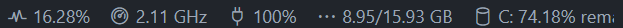

# Resource Monitor

## Features

Display CPU frequency, usage, memory consumption, and battery percentage remaining within the VSCode status bar.

## Screenshots

.

.

## Requirements

Just the system information node module.

## Extension Settings

- `resmon.showcpuusage`: Show CPU Usage. In Windows, this percentage is calculated with processor time, which doesn't quite match the task manager figure.
- `resmon.showcpufreq`: Show CPU Frequency.
- `resmon.showmem`: Show consumed and total memory as a fraction.
- `resmon.showbattery`: Show battery percentage remaining.
- `resmon.updatefrequencyms`: How frequently to query systeminformation. The minimum is 200 ms as to prevent accidentally updating so fast as to freeze up your machine.
- `resmon.frequnit`: Unit used for the CPU frequency (GHz-Hz).
- `resmon.memunit`: Unit used for the RAM consumption (GB-B).

## Known Issues

A better solution for Windows CPU Usage would be great. I investigated alternatives to counting Processor Time, but none of them seemed to match the Task Manager percentage.

---

## Change Log

### [1.0.6]

- Added DiskSpace, CPU Temperature. Adjusted battery icon.

### [1.0.5]

- Refactored code heavily, addressed Github issue with memory.used versus memory.active.

### [1.0.4]

- Added icon for store.

### [1.0.3]

- Changed icons. Added choosable units.

### [1.0.2]

- Actually properly added systeminformation as a real dependency.

### [1.0.1]

- Properly added systeminformation as a real dependency

### [1.0.0]

- Initial release
